# UX visual gallery

Canonical viewport: **412 × 915 CSS px**. These images are the committed Playwright visual contract.

## 01-plugs-dashboard

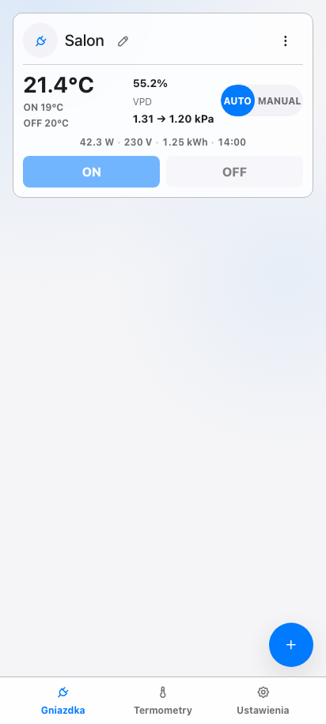

## 02-climate-automation

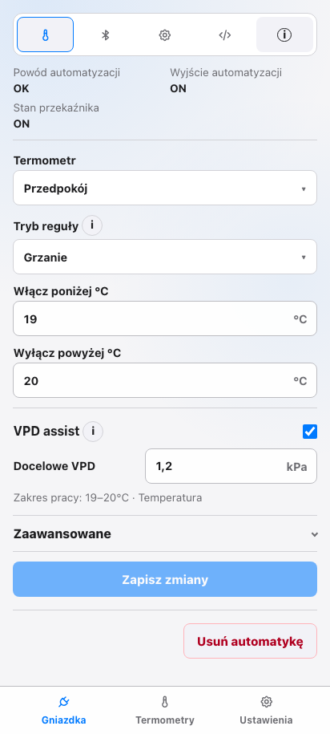

## 03-climate-ble

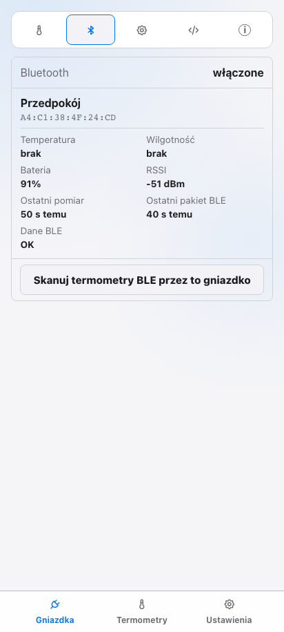

## 04-plug-ble-discovery

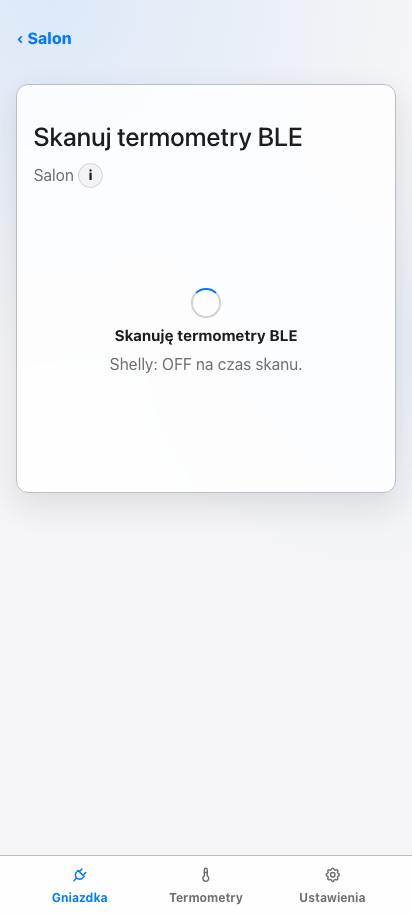

## 05-climate-device

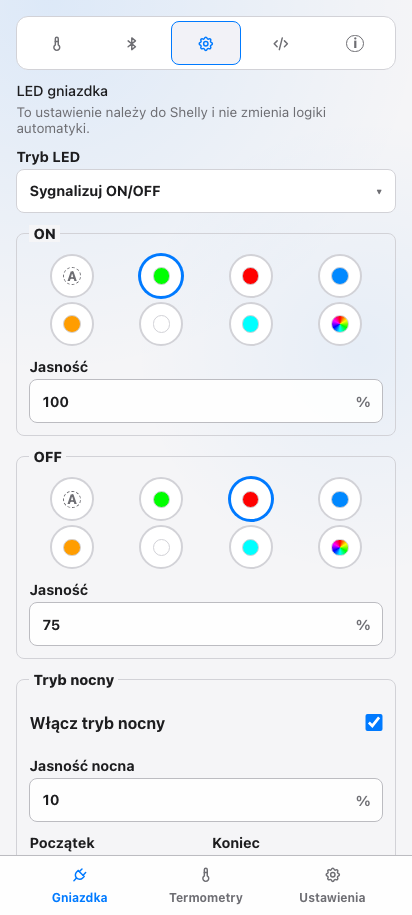

## 06-climate-script

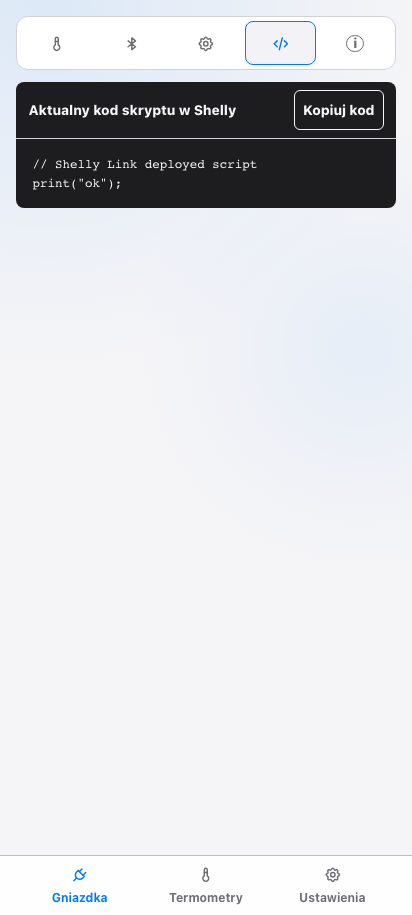

## 07-climate-info

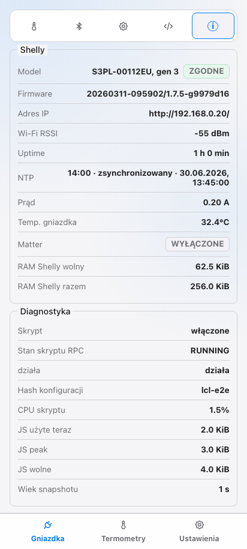

## 08-automation-intent

## 09-time-setup

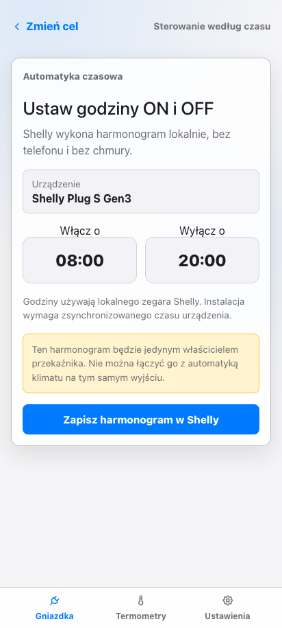

## 10-time-dashboard

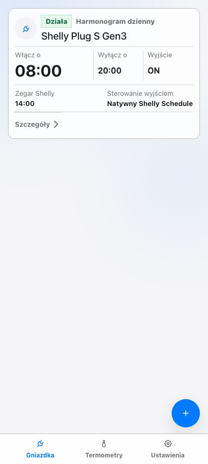

## 11-time-detail

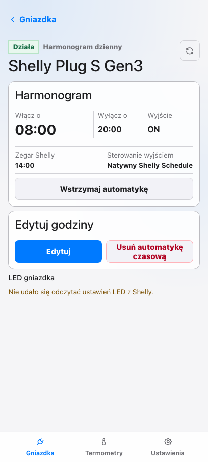

## 12-thermometers-dashboard

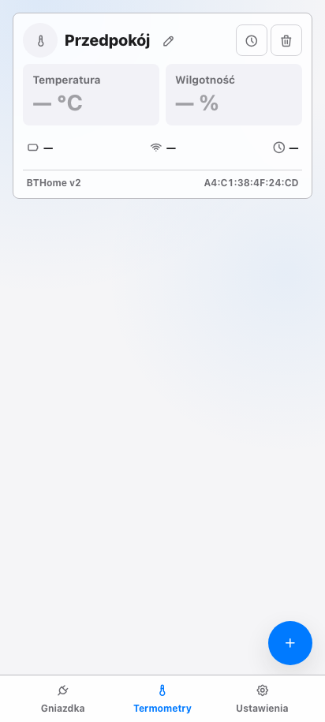

## 13-add-thermometer

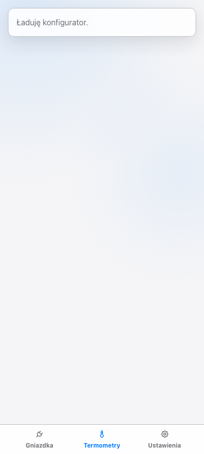

## 14-settings

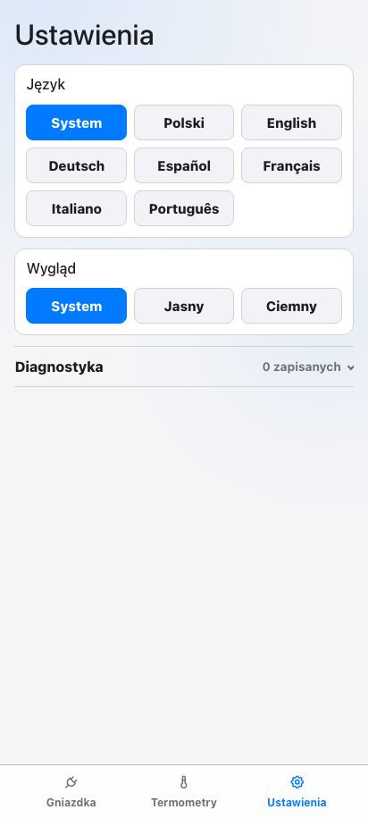

## 15-add-plug

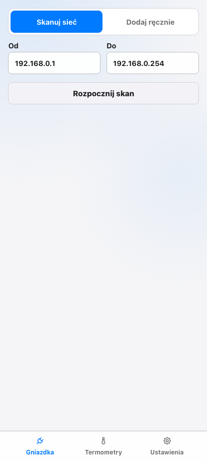

## 16-climate-setup

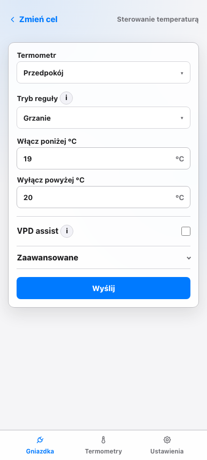

## 17-plain-plug-settings

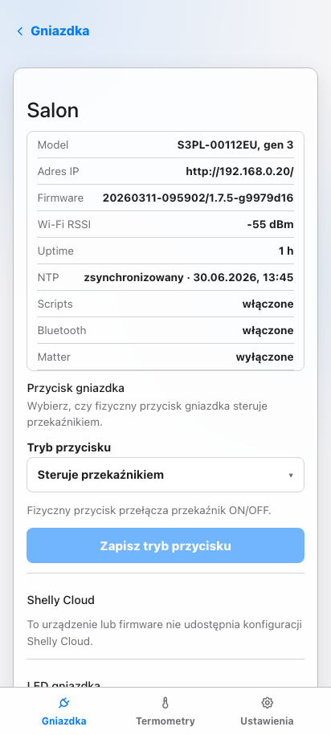

## 18-settings-diagnostics-open

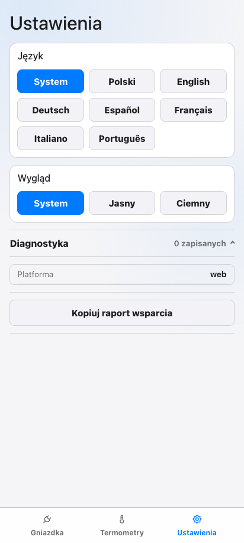

## 19-climate-advanced-open

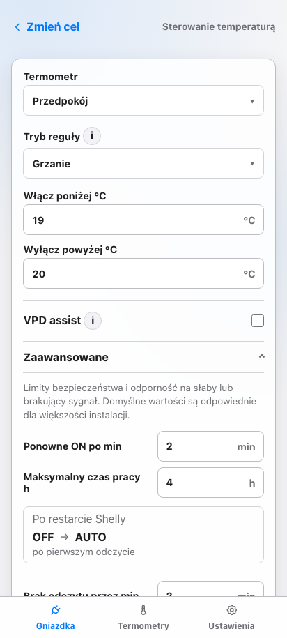
